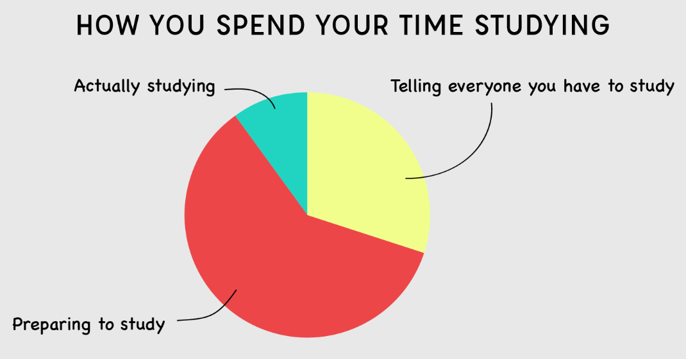

# 5th Year Revision Problems 📚



The following problems are designed to try to help you revise and recap on topics we have covered throughout the year.

## Problems ⚔️
1. Write a program that asks the user to enter three numbers. The program should print the largest number.
   
2. Your cousin, who lives in Chicago, tells you that the temperature there on a July day can be as high as 87 degrees Fahrenheit. 
Write a program to convert this temperature to 
degrees Celsius. Give your answer rounded to the 
nearest degree.

    - Display the answer with suitable text.
<details>
  <summary> 👀 Hint</summary>
   
  ````
   Use the formula: Celsius = (5/9) * (Fahrenheit - 32)
   ````

</details>


3. Write a program that prints the numbers from 1 to 10 using a ``while loop``.

4. Develop a program that allows a user to type in 6 numbers using a while loop. Read in each of the numbers and ``sum`` them, inside the loop.   
    - Calculate and print the average, outside the loop. 

5. Write a program that removes all occurrences of a given element from a ``list``.

6. Write a program that reverses the elements of a ``list``.

7. Write a program that takes a list of numbers as input and prints the sum of all the numbers.

8. Write a Python program to take in 5 numbers and store them in a list. Separately, go through the list and add 1 to each item.
    - Print out the list to test that each item has been incremented by 1.

9. Write a program that takes a list of numbers as input and prints all the even numbers in the list.

10. Write a program that takes a list of names as input and writes them to a ``text file``, each name on a new line.

11. Write a program that reads a list of numbers from a text file and prints the average of the numbers.

12. Write a program that generates a list of the first 10 Fibonacci numbers and prints the list.
<details>
  <summary> 👀 Hint</summary>
   
````
  In mathematics, the Fibonacci sequence is a sequence in which each number is the sum of the two preceding ones.
   
````

</details>


13. Write a program that asks the user to enter a number and prints all the prime numbers up to that number.
<details>
  <summary> 👀 Hint</summary>
   
````
 A prime number is a whole number greater than 1 whose only factors are 1 and itself.
````
</details>


  
